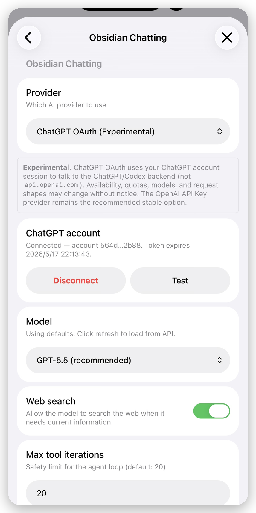
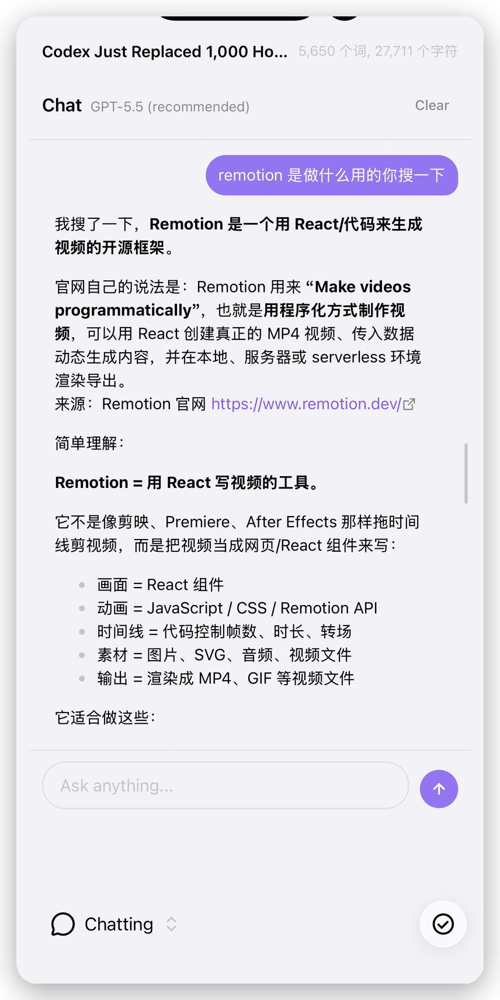
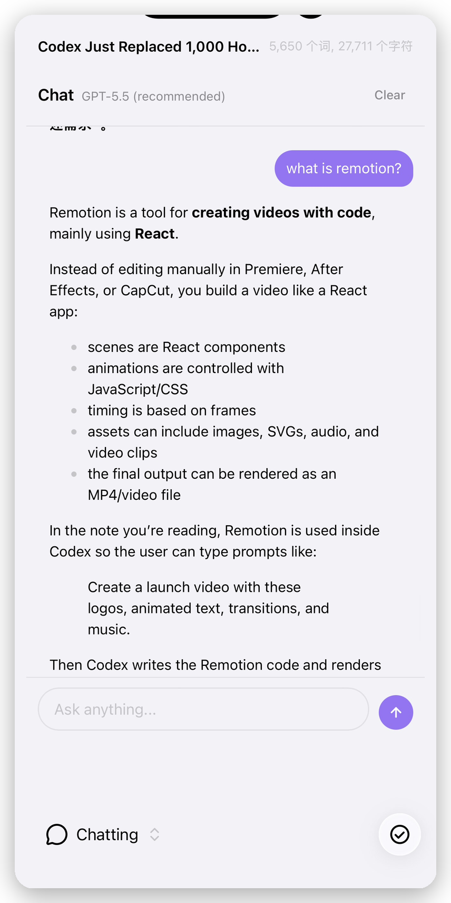

# Chatting with AI

[](https://github.com/o1xhack/obsidian-chatting/releases)
[](https://github.com/o1xhack/obsidian-chatting/releases)
[](../../LICENSE)
[](https://obsidian.md)

**一个 agentic 的 AI 助手,常驻你的 Obsidian 库 —— 手机、平板、桌面体验一致。**

> 🌐 [English](../../README.md) · **简体中文** · [繁體中文](README.zh-TW.md) · [日本語](README.ja.md)

<p align="center">
  
  
  
</p>

---

## ✨ 为什么用它?

- **三个 provider,自己挑** —— Anthropic API、OpenAI API,或者直接用你的 ChatGPT 账号登录。不搞一堆半成品 provider 的市场。
- **14 个 vault 原生工具** —— 读、改、搜索、创建、重命名、frontmatter、backlinks 全覆盖。从想法到改动文件,不用离开聊天框。
- **手机端不打折** —— 不靠 streaming、不依赖 Node-only 模块、不用 localhost 回调。iOS 和 Android 与桌面表现一致。
- **选区作用域** —— 在笔记里选中一段文字发到聊天里,助手只在选区内动手。
- **密钥进操作系统钥匙串** —— 绝不写进 `data.json`,不会被同步到别的设备。

## 🎬 一句话,自己调一串工具

你只问一次,助手自己决定调哪些工具:

```
你: 把 /Books 下面所有缺少 `rating` 属性的笔记都加上 `rating: ?`。

助手
  → search_vault("/Books")               → 12 个文件
  → get_properties("Books/Sapiens.md")   → 已有 rating
  → get_properties("Books/Hail Mary.md") → 没有 rating
  → set_properties("Books/Hail Mary.md", { rating: "?" })
  → ... (再来 5 次)

  搞定 —— 给 6 个笔记加上了 `rating: ?`:
  - Books/Hail Mary.md
  - Books/Klara and the Sun.md
  - ...
```

策略很简单:先读再改、能小改不大改、用户确认过的事不再问第二次。

## 🎯 选区作用域

在任意笔记里选中一段文字,右键 → **Send selection to Chat**。选区会以 pill 形式出现在输入框上方,助手只在选区内动手 —— 文档的其他部分一字节都不会变。

```
[ pill: "...开头有点拖沓,而且..."  ✕ ]

你: 收紧一下 —— 别丢我的语气
```

助手用作用域到选区文本的查找替换。选区之外的内容原封不动。

## 🛠️ 14 个 vault 原生工具

| 分组 | 工具 | 用途 |
|---|---|---|
| **读取** | `read_document`、`read_file`、`search_vault`、`list_files`、`get_backlinks`、`get_properties`、`get_current_datetime` | 打开任意笔记或文件;按文件名和内容搜索;浏览库结构;查找 backlinks;读取 YAML frontmatter;拿到你时区下的当前时间。 |
| **写入** | `edit_document`、`create_file`、`set_properties` | 精准查找替换 / 插入 / 整段替换;创建新笔记(父目录自动创建);安全合并或移除 YAML frontmatter。 |
| **管理** | `rename_file`、`delete_file`、`open_document`、`ask_user` | 重命名或移动(链接自动更新);移到回收站(尊重你的回收站设置);在编辑器里打开文件;不清楚的时候反过来问你。 |

## ⚙️ 三个 Provider

| Provider | 认证方式 | 默认模型 | 说明 |
|---|---|---|---|
| **Anthropic** | API key | Claude Sonnet 4.6 | 自适应思考、网络搜索、prompt 缓存。 |
| **OpenAI** | API key | Codex 5.3 | Responses API、推理、网络搜索。 |
| **ChatGPT 账号** | 登录 ChatGPT | GPT-5.5 | 用你的 ChatGPT 套餐代替 OpenAI API key。 |

> **关于 ChatGPT 账号登录。** 这个 provider 用你的 ChatGPT 账号登录,请求走的是 ChatGPT/Codex 后端(不是 `api.openai.com`),需要一份开通了 Codex 的 ChatGPT 套餐。可用模型对齐 Codex CLI 的目录。

## 🚀 快速上手

1. 打开 **设置 → 社区插件 → 浏览**。
2. 搜索 **Chatting with AI**。
3. 点击 **安装**,然后点击 **启用**。
4. **设置 → Chatting with AI** → 选 provider,粘贴 API key(或者点 **Connect ChatGPT**)。
5. 从侧边栏图标或命令面板打开聊天。

## 📦 安装

### 社区插件(推荐)

Chatting with AI 已进入官方 Obsidian 社区插件目录,这是默认的首选安装方式。

1. 在 Obsidian 里打开 **设置 → 社区插件**。
2. 如果有提示,先关闭 Restricted Mode / 打开社区插件。
3. 点击 **浏览**,搜索 **Chatting with AI**。
4. 点击 **安装**,然后点击 **启用**。

### 从 BRAT 迁移

如果你之前通过 BRAT 安装了 beta 版本,等插件市场里能搜到后可以迁移到社区版本:

1. 在 **设置 → 社区插件 → 已安装插件** 里先停用 **Chatting with AI**。
2. 打开 **BRAT** 设置,从 beta 插件列表中移除 `o1xhack/obsidian-chatting`。
3. 回到 **设置 → 社区插件 → 浏览**,搜索 **Chatting with AI**。
4. 如果 Obsidian 显示 **已安装**,进入插件详情后点击 **启用**。如果显示 **安装**,点击 **安装**,然后 **启用**。
5. 打开 **设置 → Chatting with AI**,确认 provider 设置仍然存在。

插件首次启动时会把旧的 `obsidian-chatting` 文件夹数据迁移到 `chatting-with-ai`。如果你用的是很早的 beta,社区插件浏览器没有识别为已安装,直接安装社区版本也可以;新插件启动时会执行迁移。

<details>
<summary><b>手动 release 安装</b></summary>

1. 从 [最新发布版本](https://github.com/o1xhack/obsidian-chatting/releases/latest) 下载 `main.js`、`manifest.json`、`styles.css`
2. 放入 `<vault>/.obsidian/plugins/chatting-with-ai/`
3. 重启 Obsidian,在社区插件里启用 **Chatting with AI**

</details>

<details>
<summary><b>从源码构建</b></summary>

```bash
git clone https://github.com/o1xhack/obsidian-chatting.git
cd obsidian-chatting
npm install
npm run build
```

软链到测试 vault:

```bash
ln -s "$(pwd)" /path/to/vault/.obsidian/plugins/chatting-with-ai
```

</details>

## 🧭 设计原则

| 原则 | 含义 |
|---|---|
| **移动端不是事后补丁** | 每一次改动都在 iOS 和 Android 上验证过。不用 streaming、不用 Node-only 模块、不用 localhost 回调。 |
| **三个靠谱 provider** | Anthropic + OpenAI 保稳定,ChatGPT 账号给那些不想配 API key 的人。 |
| **密钥进钥匙串** | API key 和 OAuth 凭据都走 Obsidian SecretStorage。绝不进 `data.json`,所以也不会被 Obsidian Sync 同步到别的设备。 |
| **不做向量索引** | 线性搜索 + 上限保护。可预期、无后台任务、手机内存压力小。 |
| **会话会保留** | 聊天历史在 Obsidian 重启后还在。本地 `chat-state.json`,不同步。 |
| **手机上靠右滑入** | 从右边滑入侧栏,下面的文档不被遮挡。 |

## 🗺️ 路线图

- [x] 三个 provider(Anthropic、OpenAI、ChatGPT 账号)
- [x] 14 个 vault 原生工具
- [x] iOS / Android 体验一致
- [x] 选区作用域
- [x] 上架 Obsidian 社区插件市场
- [ ] 多会话历史 + 归档/搜索
- [ ] Provider 支持的图片附件
- [ ] 自动跟进上游新发布的 provider 模型

有想法?直接开 issue。

## ❓ 常见问题

<details>
<summary><b>我的笔记会不会被上传到别处?</b></summary>

只发当前这一轮助手需要的内容。你提问的时候,助手决定调哪些工具 —— `read_document`、`search_vault` 等等 —— 这些调用拿到的内容(加上当前笔记的上下文)会发给你选的 provider。后台不会做任何上传。**不存在向量索引。**

</details>

<details>
<summary><b>移动端真的能用吗?</b></summary>

可以 —— 整个项目就是围绕这个约束设计的。请求走 Obsidian 的 `requestUrl()`(手机 WebView 强制 CORS),不用 streaming、不用 Node-only 模块、OAuth 也不用 localhost 回调。iOS、Android 跑的是和桌面一模一样的代码路径。

</details>

<details>
<summary><b>用 ChatGPT 账号登录是免费的吗?</b></summary>

它复用你已有的 ChatGPT 套餐(Plus、Pro、Team、Enterprise)—— 没有额外计费。你需要一份开通了 Codex 的 ChatGPT 套餐。插件不会请求 `api.openai.com`,而是请求 Codex CLI 用的同一套后端。

</details>

<details>
<summary><b>能不能加 X provider?</b></summary>

大概率不会 —— 把 provider 列表保持很小是个明确的取舍。两家 API provider 覆盖了主要的 API 生态,ChatGPT 账号登录覆盖了「我只有一份 ChatGPT 套餐」的情况。再加更多就要在手机端验证更多组合。

</details>

<details>
<summary><b>聊天历史存在哪里?会同步吗?</b></summary>

存在本地 `<vault>/.obsidian/plugins/chatting-with-ai/chat-state.json`。**Obsidian Sync 默认排除插件数据文件**,不会被同步。API key 通过 SecretStorage 进操作系统钥匙串,同样不同步。

</details>

## 🤝 参与贡献

欢迎提 Issue 和 PR。在提 PR 之前请:

- 跑一遍 `npx tsc --noEmit` 和 `npm run svelte-check`
- 至少在一个移动端(iOS 或 Android)上测一下 —— 「移动端不打折」是认真的
- 改动较大的话,先开 Issue 对齐方向

## 🙏 致谢

最初衍生自 [omarshahine/obsidian-chat](https://github.com/omarshahine/obsidian-chat)(同为 MIT)—— 原版权信息已保留在 `LICENSE` 中。Chatting with AI 现在是一个独立项目,有自己的路线图 —— 主要的重写包括 agent loop、移动端适配、ChatGPT 账号登录,以及选区作用域功能。

## 📄 许可证

[MIT](../../LICENSE)。

---

作者:[Yuxiao (o1xhack)](https://github.com/o1xhack) · [app.o1xhack.com](https://app.o1xhack.com)
